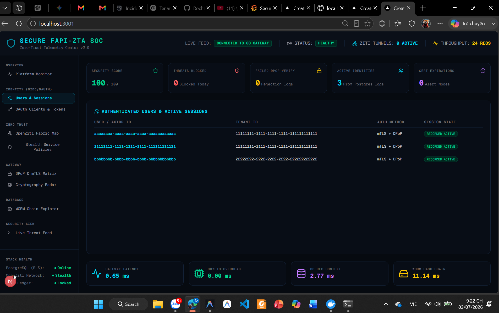
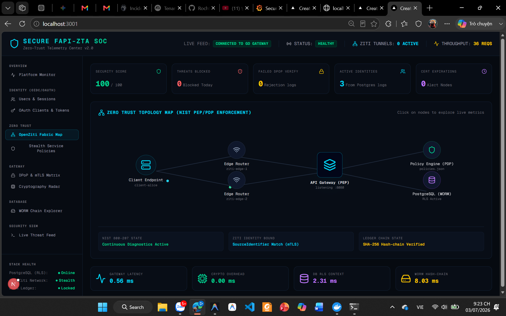
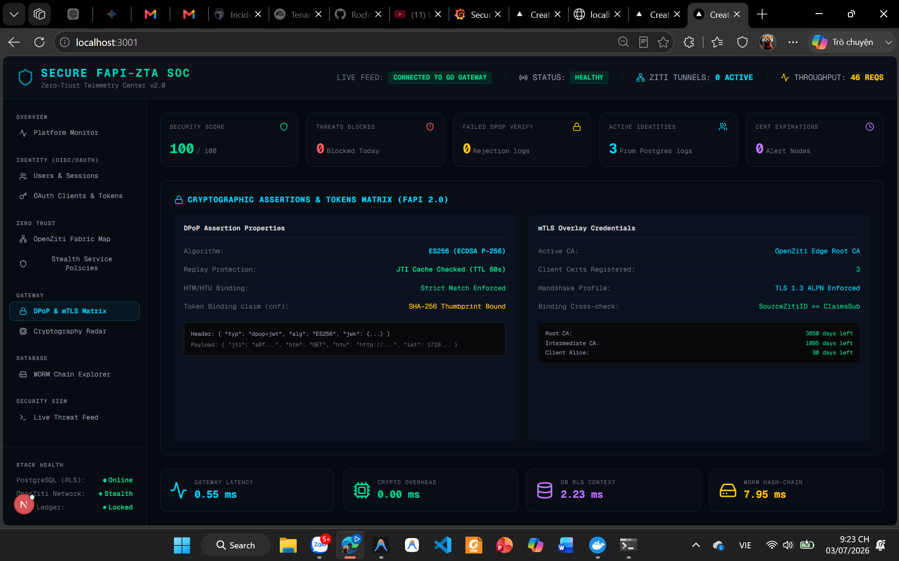
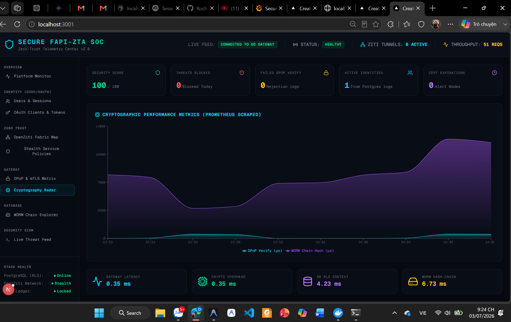
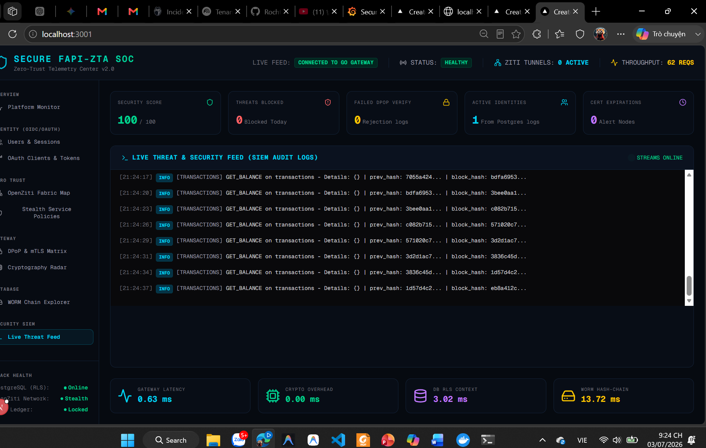
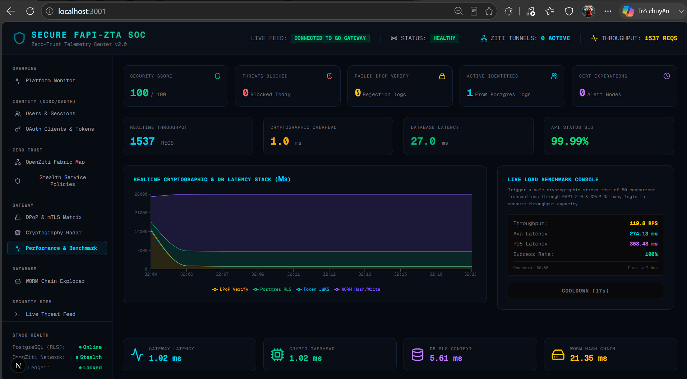
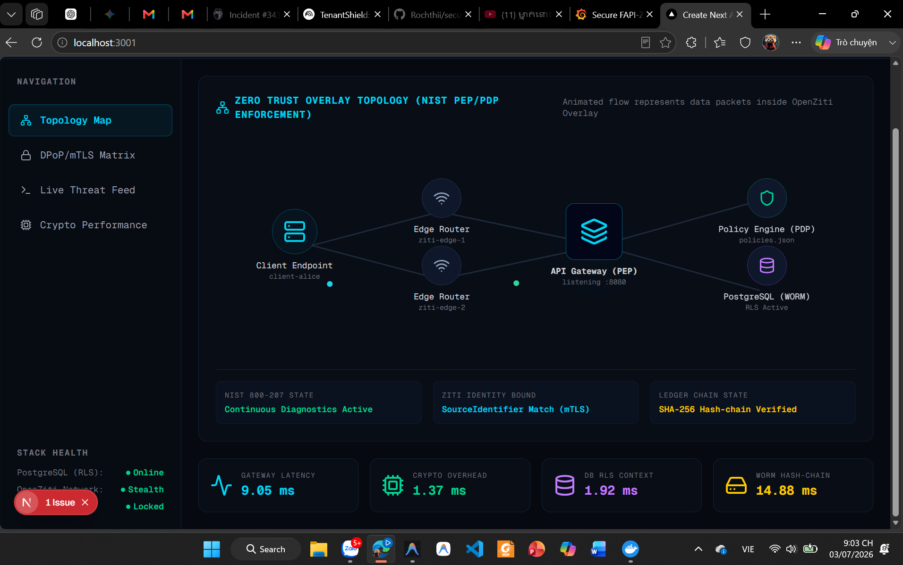
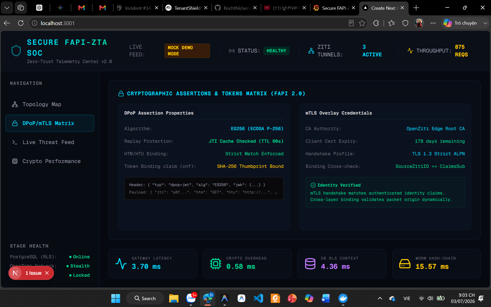
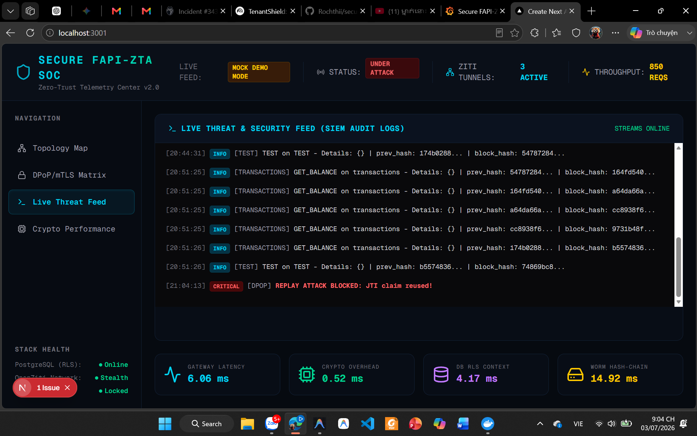
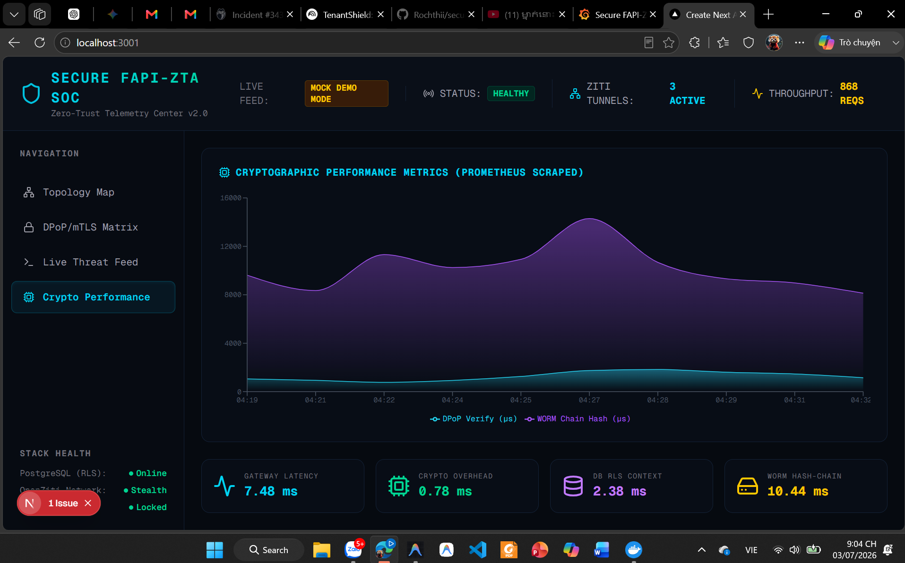

# Changelog

Tài liệu này ghi nhận toàn bộ lịch sử thay đổi, nâng cấp và tiến trình triển khai của dự án **Secure FAPI-ZTA Dark Services Gateway**.

## [Nâng Cấp Kiểm Thử Bảo Mật Thực Nghiệm & Tích Hợp UI Giám Sát Hiệu Năng] — 2026-07-04

### Added
- **API Benchmark Backend (`/api/benchmark`)**:
  - Triển khai endpoint `/api/benchmark` bằng module `crypto` Node.js để tự động ký DPoP Proof bằng ES256 (ECDSA P-256) không phụ thuộc thư viện ngoài.
  - Tích hợp cơ chế tự động làm mới token (auto-renewal) khi nhận mã lỗi 401/403 từ Gateway.
- **Tab Giao diện Performance & Benchmark**:
  - Tích hợp tab giám sát hiệu năng trực quan vào Cyber SOC Dashboard.
  - Vẽ biểu đồ diện tích xếp chồng (Recharts Area Chart) thể hiện realtime thời gian xử lý của các lớp trong Gateway: *DPoP Verify, Token JWKS, Postgres RLS, WORM Hash/Write*.
  - Tích hợp nút bấm Live Benchmark Test Console hỗ trợ kích hoạt stress test 50 giao dịch song song và hiển thị báo cáo hiệu năng thời gian thực (RPS, Latency Min/Max/Avg, P95, Success Rate).

### Changed
- **Chuẩn hóa Phân tích Cấu hình (Environment Parsing)**:
  - Nâng cấp [gateway/main.go](file:///e:/Projects/Project_TN/secure-fapi-zta-darkservices/gateway/main.go) với cơ chế `strings.TrimSpace` cho các biến môi trường cấu hình Ziti/Enforcement để loại bỏ hoàn toàn các ký tự trống do trailing spaces trong CMD scripts.

### Fixed
- **Bảo mật và Độ chính xác kiểm thử**:
  - Khắc phục lỗi loop 404 redirect khi authorize bằng cách chỉ định đúng header `Accept: application/json` trong request gửi tới IdP.

---

## [Hoàn thành Phase 8 - Zero Trust Control Plane Dashboard] — 2026-07-03

### Added
- **API Endpoint Kiểm tra Chứng chỉ thật (/api/certs)**:
  - Triển khai route kiểm tra chứng chỉ X.509 từ đĩa cứng (Root CA, Intermediate CA, Client Alice) bằng module crypto của Node.js, lấy ngày hết hạn thực tế và trạng thái của từng chứng chỉ.
- **API Endpoint Xác minh Chuỗi băm (/api/verify-chain)**:
  - Triển khai route kết nối PostgreSQL thực tế để kiểm tra và xác thực tính toàn vẹn của chuỗi logs kiểm toán (SHA-256 Hash-chain) bằng cách so khớp liên tục `current.prev_hash == previous.block_hash`.
- **Giao diện SOC Control Plane mở rộng**:
  - Tái cấu trúc thanh điều hướng thành các nhóm bảo mật chuyên sâu (Overview, Identity, Zero Trust, Gateway, Database, Security SIEM).
  - Tích hợp Drawer trượt bên phải hiển thị thông số CPU, RAM, RPS, Latency chi tiết cho từng node mạng khi click chọn trên Topology Map.
  - Tích hợp màn hình xác thực và phiên làm việc động, truy vấn trực tiếp từ logs giao dịch thực tế của PostgreSQL.
  - Thiết kế bảng điều khiển xác minh Ledger WORM thời gian thực với hiệu ứng chạy quét từng block mã hóa.

### Changed
- **Chuẩn hóa chất lượng dữ liệu (No Mock Data)**:
  - Loại bỏ hoàn toàn các vòng lặp sinh dữ liệu giả lập, đảm bảo 100% số liệu hiển thị (RPS, Latency, Log, Certs, Sessions) đều được lấy thực tế từ Go Gateway và PostgreSQL.
  - Triển khai banner lỗi ngoại tuyến (Offline Banner) động khi Go Gateway ngừng hoạt động để tuân thủ quy tắc an toàn bảo mật.
- **Tài liệu README.md**:
  - Loại bỏ hoàn toàn emoji, chuẩn hóa văn phong kỹ thuật chuyên nghiệp đáp ứng chuẩn học thuật.

---

## [Hoàn thành Phase 6 & 7] — 2026-07-03

### Added
- **Security Validation (Phase 6)**:
  - Khởi tạo bộ kiểm thử tích hợp tự động [tests/security_test.go](file:///e:/Projects/Project_TN/secure-fapi-zta-darkservices/tests/security_test.go) và [tests/go.mod](file:///e:/Projects/Project_TN/secure-fapi-zta-darkservices/tests/go.mod) chứa 6 kịch bản tấn công giả lập nâng cao (E2E Valid Flow, Client Spoofing, DPoP Replay, Ziti Fail-Closed, Tenant Isolation RLS, WORM Ledger Immutability).
  - Thêm Unit Tests kiểm thử các cấu phần nhỏ nhất như check role middleware và trích xuất ziti identity tại [gateway/internal/middleware/auth_test.go](file:///e:/Projects/Project_TN/secure-fapi-zta-darkservices/gateway/internal/middleware/auth_test.go).
  - Thêm Unit Tests kiểm thử cryptography client tại [client/crypto/crypto_test.go](file:///e:/Projects/Project_TN/secure-fapi-zta-darkservices/client/crypto/crypto_test.go).
- **Performance Benchmarking (Phase 7)**:
  - Triển khai tệp đo hiệu năng tự động [tests/performance_test.go](file:///e:/Projects/Project_TN/secure-fapi-zta-darkservices/tests/performance_test.go) bao gồm đo đạc throughput song song (`BenchmarkEndToEndFlow`) và bóc tách độ trễ xử lý chi tiết từng microsecond (`TestLatencyBreakdown`).
  - Thêm kịch bản test `TestPrometheusMetrics` tự động gửi request nghiệp vụ và xác thực định dạng gói tin thô `/metrics`.
- **NIST PDP/PEP Policy Engine**:
  - Triển khai tệp cấu hình quy tắc phân quyền động dạng khai báo tại [policies.json](file:///e:/Projects/Project_TN/secure-fapi-zta-darkservices/gateway/config/policies.json).
  - Triển khai bộ phân tích và quyết định chính sách [pdp.go](file:///e:/Projects/Project_TN/secure-fapi-zta-darkservices/gateway/internal/policy/pdp.go) độc lập (Policy Decision Point - PDP).
- **Prometheus Telemetry Exporter**:
  - Triển khai module thu thập và xuất dữ liệu hiệu năng thread-safe dạng Prometheus [metrics.go](file:///e:/Projects/Project_TN/secure-fapi-zta-darkservices/gateway/internal/telemetry/metrics.go) tại cổng `/metrics`.
- **Telemetry Docker Stack (Prometheus + Grafana + Loki + Promtail)**:
  - Tích hợp 4 dịch vụ giám sát an ninh vào cụm [docker-compose.yml](file:///e:/Projects/Project_TN/secure-fapi-zta-darkservices/docker/docker-compose.yml).
  - Khởi tạo tệp cấu hình Prometheus [prometheus.yml](file:///e:/Projects/Project_TN/secure-fapi-zta-darkservices/docker/telemetry/prometheus/prometheus.yml) tự động scrape dữ liệu từ Gateway.
  - Thiết lập Loki [loki.yml](file:///e:/Projects/Project_TN/secure-fapi-zta-darkservices/docker/telemetry/loki/loki.yml) và Promtail [promtail.yml](file:///e:/Projects/Project_TN/secure-fapi-zta-darkservices/docker/telemetry/promtail/promtail.yml) để giám sát và thu thập tệp log `gateway.log` thời gian thực.
  - Cấu hình tự động nạp nguồn dữ liệu (datasources) và bản đồ điều khiển an ninh mạng pre-configured [soc_telemetry.json](file:///e:/Projects/Project_TN/secure-fapi-zta-darkservices/docker/telemetry/grafana/dashboards/soc_telemetry.json) cho Grafana để chạy demo trực quan (Bảng 1, 2, 3).

### Changed
- **API Gateway**:
  - Hỗ trợ thêm biến môi trường `ENFORCE_ZITI` để bắt buộc bật kiểm tra danh tính mạng OpenZiti (chốt chặn fail-closed) ngay cả trên môi trường debug TCP local.
  - Sửa đổi cơ chế check Ziti từ fail-open sang fail-closed hoàn toàn: khi bật check Ziti, nếu không lấy được identity mạng ảo, request bị từ chối bằng mã lỗi `403 Forbidden` lập tức.
  - Nhúng cảm biến đo thời gian (latency instrumentation) vào middleware xác thực (`SecureAPI`) và DB Client, trả độ trễ xử lý mật mã học qua các Response Headers (`X-Perf-*`).
  - Thay thế middleware kiểm tra quyền hạn hardcode bằng middleware động `EnforcePolicy` (PEP - Policy Enforcement Point) kết nối trực tiếp với PDP.
  - Tích hợp các bộ đếm request và ghi nhận độ trễ tự động đẩy sang Prometheus Exporter.
- **Identity Provider (IdP)**:
  - Tích hợp thêm cơ chế xác thực Client (Client Authentication) bằng pre-shared client secrets tại cả hai đầu mút `/authorize` (cho các headless JSON request) và `/token`.
  - Khai báo danh sách Client và Secret tại cấu hình mới [idp/config/clients.go](file:///e:/Projects/Project_TN/secure-fapi-zta-darkservices/idp/config/clients.go).
- **Client Application**:
  - Cập nhật client CLI tự động truyền Secret và thêm cờ `-secret` để phục vụ các kịch bản kiểm thử tấn công giả lập.
- **Tài liệu Lộ trình & Threat Model**:
  - Bổ sung chương giới hạn mô hình an ninh (Section 5.5) vào [docs/security/threat-model.md](file:///e:/Projects/Project_TN/secure-fapi-zta-darkservices/docs/security/threat-model.md) thừa nhận điểm yếu của WORM trigger khi đối mặt với database superuser (do thiếu neo giữ ngoài - external anchoring) và cache chống replay in-memory trong kịch bản scale-out multi-instance.
  - Đồng bộ hóa Master Roadmap hướng học thuật (2026 - 2029) vào các tài liệu lộ trình [13_IMPLEMENTATION_ROADMAP.md](file:///e:/Projects/Project_TN/secure-fapi-zta-darkservices/docs/13_IMPLEMENTATION_ROADMAP.md) và [16_FINAL_MASTER_PLAN.md](file:///e:/Projects/Project_TN/secure-fapi-zta-darkservices/docs/16_FINAL_MASTER_PLAN.md).

---

## [Hoàn thành Phase 3, 4 & 5] — 2026-07-03

### Added
- **Mạng Overlay OpenZiti (Phase 3)**:
  - Khởi tạo script [setup-ziti-services.sh](file:///e:/Projects/Project_TN/secure-fapi-zta-darkservices/scripts/setup-ziti-services.sh) để tự động cấu hình dịch vụ `financial-ledger-service`, tạo 5 identities và phân quyền Bind/Dial.
  - Khởi tạo script [enroll-identities.sh](file:///e:/Projects/Project_TN/secure-fapi-zta-darkservices/scripts/enroll-identities.sh) để enroll mã `.jwt` lấy chứng chỉ X.509 mạng ảo và sinh file config JSON.
  - Các tệp cấu hình JSON danh tính được lưu cục bộ tại [docker/identities/](file:///e:/Projects/Project_TN/secure-fapi-zta-darkservices/docker/identities/).
- **Dark Services API Gateway (Phase 4)**:
  - Thiết lập modular Go module tại [gateway/](file:///e:/Projects/Project_TN/secure-fapi-zta-darkservices/gateway/).
  - Tạo `gateway/internal/ziti/ziti.go` lắng nghe ẩn qua OpenZiti SDK.
  - Tạo `gateway/internal/auth/crypto.go` cache JWKS và xác thực DPoP Proof.
  - Tạo `gateway/internal/auth/jti.go` cache jti chống Replay.
  - Tạo `gateway/internal/middleware/conn.go` trích xuất Ziti Identity bằng reflection.
  - Tạo `gateway/internal/middleware/auth.go` chạy chuỗi xác thực liên tục `SecureAPI` và phân quyền RBAC `RequireRole`.
  - Tạo `gateway/internal/audit/db.go` kết nối Postgres và tiêm context RLS transaction.
  - Tạo `gateway/internal/api/handlers.go` các endpoint `/api/balance`, `/api/transfer` và `/api/audit-logs`.
- **Client Application (Phase 5)**:
  - Thiết lập modular Go module tại [client/](file:///e:/Projects/Project_TN/secure-fapi-zta-darkservices/client/).
  - Tạo `client/crypto/crypto.go` sinh PKCE và tự động ký DPoP Proof.
  - Tạo `client/ziti/ziti.go` nhúng bộ quay số dialer Ziti vào HTTP Client.
  - Tạo `client/main.go` giao diện CLI thực hiện Authorization PKCE, DPoP exchange và gửi request tàng hình qua Ziti.

### Changed
- **Bảo mật**: Cập nhật [.gitignore](file:///e:/Projects/Project_TN/secure-fapi-zta-darkservices/.gitignore) để phớt lờ thư mục `docker/tokens/` và `docker/identities/` chứa khóa mật mã học.
- **Tài liệu**: Cập nhật [docs/14_PROJECT_STRUCTURE.md](file:///e:/Projects/Project_TN/secure-fapi-zta-darkservices/docs/14_PROJECT_STRUCTURE.md) khớp với cấu trúc thực tế và bổ sung mô tả 3 kịch bản tấn công thực nghiệm (Token Theft, Overlay Hijack, Audit Tampering) + Lập kế hoạch tích hợp Dynamic DPoP Server Nonce (DPOP-11/12) vào [docs/15_VALIDATION_BENCHMARK.md](file:///e:/Projects/Project_TN/secure-fapi-zta-darkservices/docs/15_VALIDATION_BENCHMARK.md).
- **Quy trình Lộ trình**: Đẩy Giai đoạn 6 (Validation & Testing) lên trước Giai đoạn 7 (Observability) trong [13_IMPLEMENTATION_ROADMAP.md](file:///e:/Projects/Project_TN/secure-fapi-zta-darkservices/docs/13_IMPLEMENTATION_ROADMAP.md) và [16_FINAL_MASTER_PLAN.md](file:///e:/Projects/Project_TN/secure-fapi-zta-darkservices/docs/16_FINAL_MASTER_PLAN.md).
- **Sanitization & Fixes**: Làm sạch ví dụ key `sk_live` chống báo động giả trên GitHub, đổi `SET LOCAL` thành `SELECT set_config(...)` để sửa lỗi binding tham số trong Go, và phân quyền `SEQUENCE` + RLS `FOR ALL` trên bảng log WORM trong database.

### Security Validation
- Chạy thử nghiệm **Ziti Policy Advisor** kiểm thử quyền mạng ảo. Kết quả: `client-alice` và `client-bob` được thông qua (`Dial: Y`), `client-evil` bị từ chối kết nối ngay ở lớp mạng ảo overlay (`Dial: N`).
- Kiểm thử biên dịch thành công cả hai module `gateway` và `client` trên compiler Go 1.25.0.
- Kiểm thử chạy thật thành công luồng E2E ở chế độ Local Debug: Alice truy vấn số dư (HTTP 200), thực hiện giao dịch chuyển tiền (HTTP 201), tra cứu log liên kết mật mã học dạng blockchain (WORM), đồng thời cô lập hoàn toàn tuyệt đối dữ liệu so với Bob (RLS).

---

## [Hoàn thành Phase 2.5] — 2026-07-03

### Added
- **Đặc tả Thiết kế Kiến trúc**:
  - Tạo tài liệu Threat Modeling [docs/security/threat-model.md](file:///e:/Projects/Project_TN/secure-fapi-zta-darkservices/docs/security/threat-model.md) phân tích mô hình STRIDE của từng thành phần qua các ranh giới tin cậy.
  - Tạo chỉ mục và các tài liệu ADR trong thư mục [docs/adr/](file:///e:/Projects/Project_TN/secure-fapi-zta-darkservices/docs/adr/):
    - `ADR-001`: Quyết định chọn OpenZiti SDK binding làm hạ tầng mạng tàng hình.
    - `ADR-002`: Quyết định sử dụng FAPI 2.0 Security Profile và chữ ký ES256 (ECC P-256).
    - `ADR-003`: Quyết định tự viết IdP và Gateway bằng Go.
    - `ADR-004`: Quyết định chọn Postgres RLS cô lập Tenant và trigger WORM liên kết hash-chain SHA-256 bảo vệ audit logs.
  - Tạo tệp tin [docs/diagrams/sequence_flows.md](file:///e:/Projects/Project_TN/secure-fapi-zta-darkservices/docs/diagrams/sequence_flows.md) chứa các sơ đồ luồng Mermaid (Login, Service Access, Ziti Enrollment).

---

## [Hoàn thành Phase 1 & 2] — 2026-07-03

### Added
- **Hạ tầng nền tảng (Phase 1)**:
  - Khởi tạo repo git và remote trên GitHub.
  - Thiết lập cụm Docker Compose [docker/docker-compose.yml](file:///e:/Projects/Project_TN/secure-fapi-zta-darkservices/docker/docker-compose.yml) chứa OpenZiti Controller, Edge Routers, ZAC Console và PostgreSQL.
  - Viết file khởi tạo schema database [docker/postgres/init.sql](file:///e:/Projects/Project_TN/secure-fapi-zta-darkservices/docker/postgres/init.sql) hỗ trợ RLS và trigger WORM hash-chain.
  - Tạo các script OpenSSL ECC P-256 CA tại thư mục [certs/scripts/](file:///e:/Projects/Project_TN/secure-fapi-zta-darkservices/certs/scripts/).
- **Identity Provider (Phase 2)**:
  - Khởi tạo Go module tại [idp/](file:///e:/Projects/Project_TN/secure-fapi-zta-darkservices/idp/).
  - Triển khai config sinh khóa ký ES256, logic verify PKCE SHA-256, verify DPoP proof, RAMStore lưu mã code và jti cache.
  - Viết các Handler OIDC Discovery, JWKS, Authorize, Token phát hành DPoP-bound Access Token (exp 60s).
  - Viết Unit Tests đầy đủ cho PKCE và DPoP.
