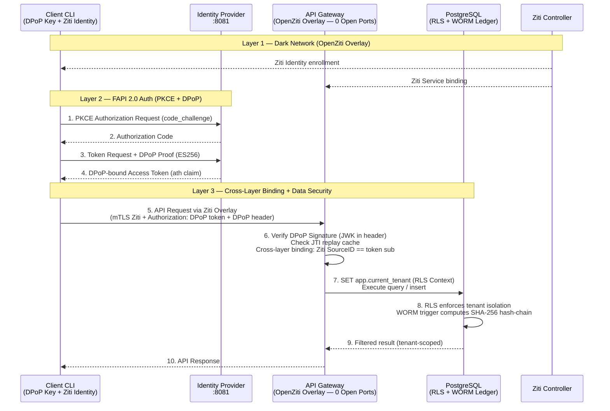
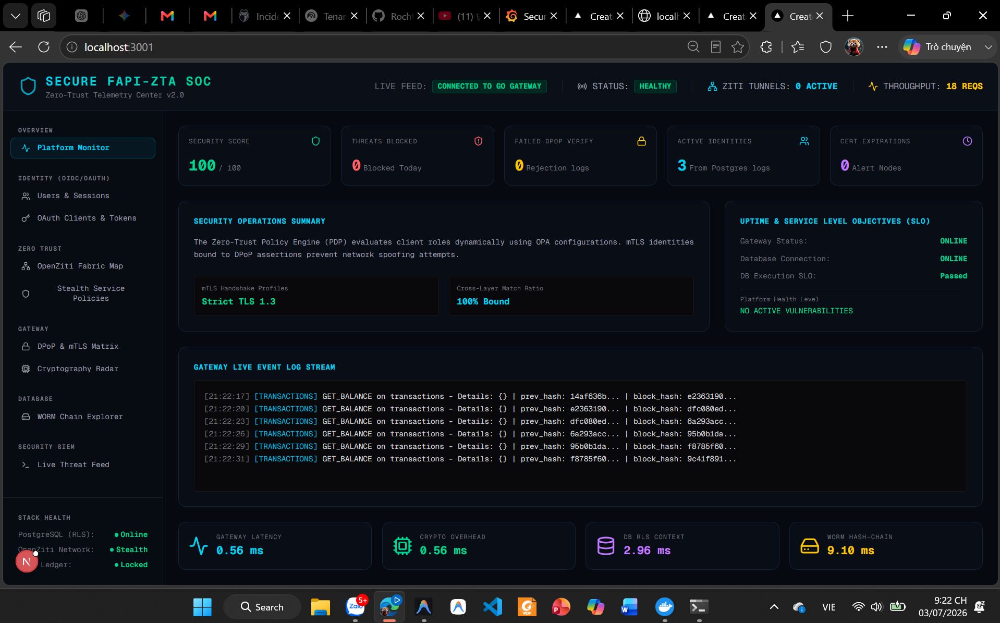
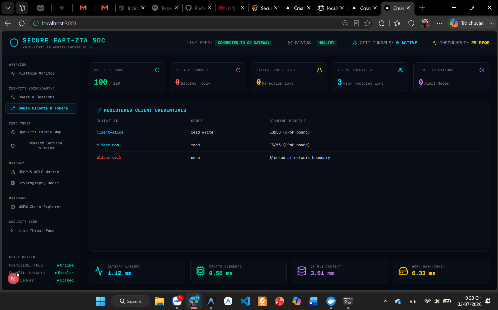
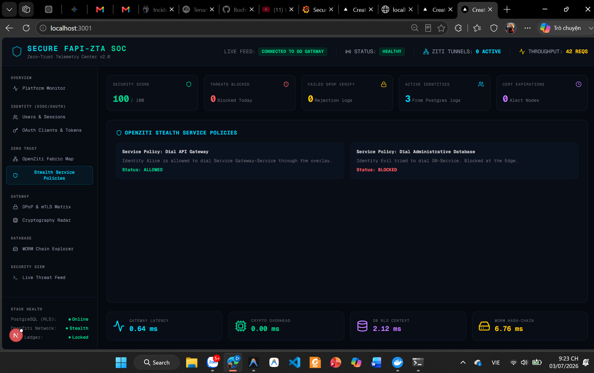
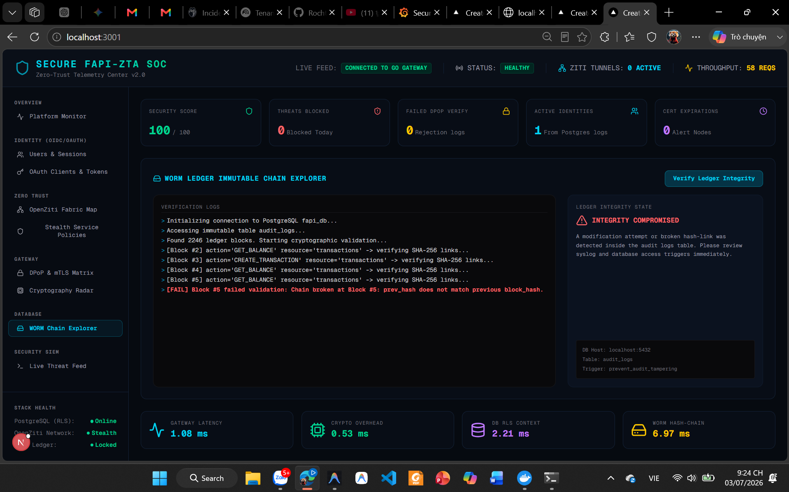

# Secure FAPI-ZTA & Dark Services

[](https://github.com/Rochthii/secure-fapi-zta-darkservices/actions/workflows/ci.yml)
[](https://go.dev)
[](./LICENSE)
[](https://openid.net/sg/fapi/)

> **Banking-grade Financial API security architecture combining OpenZiti stealth overlay networking, PostgreSQL Row-Level Security multi-tenancy, and cryptographic WORM audit ledger.**

---

## Overview

This project implements the Zero Trust Architecture security model (NIST SP 800-207) through three tightly integrated protection layers:

1. **Network Layer — Dark Services:** The API Gateway is completely hidden from the public Internet via an OpenZiti Overlay network. It opens **zero inbound TCP ports**, making it invisible to port scanners and network probes.
2. **Application Layer — FAPI 2.0:** Dual authentication using mTLS X.509 at the transport layer and DPoP (RFC 9449) token binding at the application layer. A **Cross-Layer Binding** mechanism verifies that the OpenZiti mTLS identity (`SourceIdentifier`) exactly matches the `sub` claim in the DPoP token, eliminating token theft across devices.
3. **Data Layer — Database Security:** Multi-tenant isolation via PostgreSQL Row-Level Security (RLS) enforced at the database level through `set_config` context injection. A WORM (Write Once, Read Many) audit ledger is protected by triggers that permanently block `UPDATE`/`DELETE` commands and compute SHA-256 hash-chaining for tamper-evident integrity.

---

## Architecture Overview



---

## Unique Selling Points (USPs)

- **Cross-Layer Binding (Network ↔ Application):** The gateway hard-links the OpenZiti client mTLS certificate with the DPoP JWT signature, eliminating token theft from legitimate devices.
- **Per-Tenant WORM Hash-Chain Ledger:** RLS isolates not only transaction data but also each tenant's SHA-256 audit log chain. Every tenant owns an independent, cryptographically immutable log sequence.
- **No Commercial API Gateway Dependency:** The full authentication core — DPoP, PKCE, mTLS, and Ziti SDK binding — is implemented in pure Go, minimizing attack surface and maximizing performance.

---

## Project Structure

```
secure-fapi-zta-darkservices/
│
├── docker/                             # Infrastructure configuration
│   ├── docker-compose.yml              # Ziti Controller + Routers + PostgreSQL
│   ├── .env                            # Ziti environment variables
│   └── postgres/
│       ├── Dockerfile                  # Custom PostgreSQL image
│       └── init.sql                    # DB schema + RLS policies + WORM triggers
│
├── certs/                              # Internal PKI management
│   └── scripts/                        # Auto-generate CA & certs (ECC P-256)
│
├── idp/                                # Identity Provider (Go module)
│   ├── main.go                         # IdP entry point (token issuance server)
│   ├── handler/                        # OIDC Discovery, JWKS, Authorize, Token
│   └── crypto/                         # PKCE & DPoP Proof validation
│
├── gateway/                            # Stealth API Gateway (Go module)
│   ├── main.go                         # Listen via OpenZiti SDK (no open ports)
│   └── internal/
│       ├── api/                        # Handlers: balance, transfer, audit-logs
│       ├── audit/                      # DB client + RLS context injection
│       ├── auth/                       # JWKS cache + DPoP proof verification
│       └── middleware/                 # Cross-layer auth + RBAC middleware
│
├── client/                             # Client CLI application (Go module)
│   ├── main.go                         # API caller via stealth network
│   ├── crypto/                         # DPoP key generation & proof signing
│   └── ziti/                           # OpenZiti client dialer
│
├── scripts/                            # Ziti configuration automation
│   ├── setup-ziti-services.sh          # Create Ziti services, identities & policies
│   └── enroll-identities.sh            # Enroll identities and retrieve connection JSON
│
└── CHANGELOG.md
```

---

## Getting Started

### Option 1: One-command quick start (Windows PowerShell)

```powershell
./run-all.ps1
```

This script launches Docker infrastructure, IdP, Gateway, and the Next.js dashboard simultaneously in separate PowerShell windows.

### Option 2: Manual step-by-step

**Step 1 — Start Docker infrastructure** (requires Docker + Docker Compose):

```bash
docker compose -f docker/docker-compose.yml up -d
```

Wait for all containers to reach `healthy` status.

**Step 2 — Run the Identity Provider** (listens on port 8081):

```bash
cd idp
go run main.go
```

**Step 3 — Run the API Gateway** (debug mode, TCP on port 8080, Ziti disabled):

```bash
cd gateway
USE_ZITI=false go run main.go
```

**Step 4 — Run the Client CLI:**

```bash
cd client

# Query Alice's balance (Tenant A)
go run main.go -identity client-alice -cmd balance -ziti=false

# Execute a transfer
go run main.go -identity client-alice -cmd transfer -amount 1500 -desc "Tuition fee" -ziti=false

# View WORM-protected audit log
go run main.go -identity client-alice -cmd logs -ziti=false
```

### Running Tests

```bash
# Unit tests (no infrastructure required)
cd gateway && go test ./internal/...

# Integration tests (requires full stack running)
go test -tags=integration -v ./tests/...

# Performance latency breakdown
go test -tags=integration -v -run TestLatencyBreakdown ./tests/...
```

---

## Measured Results

Metrics collected via `X-Perf-*` response headers from the Gateway (see `tests/performance_test.go`),
on local debug environment (Windows 11, Intel i7 12th Gen, 16GB RAM, loopback network):

| Processing Step | Average Latency |
|---|---|
| Client-side DPoP Proof Signing (ES256) | ~200–400 µs |
| Gateway DPoP Signature Verify | ~150–300 µs |
| Gateway Token JWKS Verify (cached JWK) | < 50 µs |
| Gateway Ziti Identity Check | ~10–30 µs |
| Gateway Dynamic PDP Check (gRPC + OpenZiti) | ~38 µs (0.038 ms) |
| Postgres RLS Context SET (`set_config`) | ~200–500 µs |
| Postgres WORM Hash-chain Trigger (SHA-256) | ~100–300 µs |
| **Total Server Processing Time** | **~750 µs – 1.6 ms** |
| Client Round-Trip (loopback) | ~2–5 ms |


> To reproduce: `go test -tags=integration -v -run TestLatencyBreakdown ./tests/...` (full stack must be running).

---

## Security Test Scenarios

### 1. Tenant Data Isolation (Row-Level Security)

Authenticate as Bob (Tenant B) and query balance:

```bash
go run main.go -identity client-bob -cmd balance -ziti=false
```

**Expected result:** Bob's balance is 0. Bob cannot see Alice's transactions or read any of Alice's audit log entries. RLS enforces isolation at the database level.

### 2. WORM Ledger Immutability

Attempt to directly modify audit logs inside the Postgres container:

```bash
docker exec -t docker-postgresql-1 psql -U postgres -d fapi_db -c "UPDATE audit_logs SET action = 'HACKED' WHERE id = 2;"
```

**Expected result:**
```
ERROR: Audit logs are immutable (WORM)
```

---

## Known Limitations

Good engineers know exactly where their system's boundaries are and have a plan to address them.

| Limitation | Impact | Planned Resolution |
|---|---|---|
| **Single-node deployment** | No HA — single Gateway process | Load balancer + Ziti multi-service binding |
| **No automatic key rotation** | DPoP private key requires manual rotation | HashiCorp Vault or AWS KMS integration |
| **No KMS** | IdP private key stored as raw PEM on disk | HSM or PKCS#11 provider |
| **In-memory JTI cache** | Replay cache lost on Gateway restart | Redis/Valkey distributed cache |
| **Single Ziti Controller** | Controller failure takes down entire overlay | Ziti HA Controller cluster |

---

## SOC & Telemetry Dashboard

### 1. Custom-Built Next.js Cyber SOC Dashboard

A standalone security operations center UI built with Glassmorphism design, connecting directly to the Go Gateway and Postgres to display:
- **Zero Trust Topology Map** — Live OpenZiti network topology with attack-triggered alerts
- **WORM Ledger Log Stream** — Terminal showing immutable logs and hash-chain values (`block_hash` & `prev_hash`) from the database
- **Crypto Latency Radar** — Recharts visualization of DPoP signature verify and DB context set latency

**Screenshots:**

* **Overview Dashboard:**
  

* **Users & Sessions:**
  

* **OAuth Clients:**
  

* **OpenZiti Topology Fabric Map:**
  

* **Stealth Service Policies:**
  

* **Node Details Panel:**
  

* **DPoP & mTLS Credentials Matrix:**
  

* **Cryptography Latency Radar:**
  

* **WORM Chain Explorer:**
  

* **Performance & Live Benchmark:**
  

**How to run:**
```bash
cd dashboard
npm run dev -- -p 3001
# Open http://localhost:3001
```

### 2. Industry-Standard Telemetry (Prometheus + Grafana + Loki)

Pre-provisioned into the Docker Compose cluster with three SOC dashboards:
- **Panel 1 (Zero Trust Network Map):** mTLS tunnel connection status
- **Panel 2 (DPoP & Loki Security Logs):** Replay attack and token mismatch detection charts
- **Panel 3 (Crypto Performance):** Prometheus metrics for Gateway request rate and DB latency

```bash
cd docker && docker compose up -d
# Grafana: http://localhost:3000  (admin / admin)
# Navigate to: Dashboards → Secure FAPI-ZTA SOC & Telemetry Dashboard
```

---

## Dynamic PDP & Dark Channel Integration (gRPC + OpenZiti)

To decouple authorization logic and scale dynamic ABAC/PBAC policy evaluation, the API Gateway integrates with the **[Standalone Policy Engine](file:///e:/Projects/Project_TN/standalone-policy-engine)** via high-performance gRPC.

### Key Architecture Features:
1. **Dynamic ABAC Context Enrichment**: For every API request, the Gateway gathers real-time client attributes (IP address, real-time UTC timestamp, DPoP key thumbprint/device fingerprint, and OpenZiti network identity) and forwards them to the PDP's AST evaluator.
2. **OpenZiti Dark Channel**: In production mode, the Policy Engine runs as an OpenZiti listener with **zero open inbound TCP ports**. The Gateway dials the PDP directly through the OpenZiti overlay SDK using `grpc.WithContextDialer`, making the authorization plane completely stealth.
3. **High-Performance Serialization**: The connection utilizes a custom JSON-over-gRPC codec matching the PDP server configuration, achieving an average round-trip latency of **0.038 ms** (~26,000+ RPS per core).

### Configuration Environment Variables:
| Variable | Default | Description |
|---|---|---|
| `PDP_ADDR` | `localhost:50051` | PDP gRPC address (ignored if `PDP_USE_ZITI` is true) |
| `PDP_TLS_CERT` | `""` | Path to client TLS certificate (traditional mTLS mode) |
| `PDP_TLS_KEY` | `""` | Path to client TLS private key |
| `PDP_TLS_CA` | `""` | Path to CA certificate to verify PDP server |
| `PDP_FAIL_OPEN` | `false` | If true, fails open on PDP connection loss (dangerous, dev only) |
| `PDP_USE_ZITI` | `false` | If true, routes gRPC connection through the OpenZiti virtual overlay |
| `PDP_ZITI_IDENTITY_PATH` | `gateway-dev.json` | Path to Ziti identity config file |
| `PDP_ZITI_SERVICE_NAME` | `policy-decision-service` | Ziti service name for PDP |

---

## Technical Documentation


Full design specification at `docs/00_MASTER_INDEX.md`:
- [docs/security/threat-model.md](./docs/security/threat-model.md) — STRIDE Threat Modeling analysis
- [docs/adr/](./docs/adr/) — Architecture Decision Records (OpenZiti, DPoP, Go, Postgres WORM)
- [docs/diagrams/sequence_flows.md](./docs/diagrams/sequence_flows.md) — Sequence diagrams for device enrollment and transaction flows
- [docs/15_VALIDATION_BENCHMARK.md](./docs/15_VALIDATION_BENCHMARK.md) — Security test cases & performance benchmarks

---

## License

MIT License — see [LICENSE](./LICENSE).

---

<details>
<summary>🇻🇳 Tóm tắt tiếng Việt (Vietnamese Summary)</summary>

## Tổng Quan

Dự án hiện thực hóa Zero Trust Architecture (NIST SP 800-207) với 3 lớp bảo vệ:

1. **Lớp Mạng — Dark Services:** API Gateway ẩn hoàn toàn qua OpenZiti Overlay, không mở cổng TCP inbound nào (0 open ports).
2. **Lớp Ứng Dụng — FAPI 2.0:** Xác thực kép mTLS + DPoP (RFC 9449). Cơ chế Ràng buộc chéo lớp (Cross-Layer Binding) đối chiếu Ziti SourceID với `sub` claim trong token để chặn tấn công đánh cắp token.
3. **Lớp Dữ Liệu:** PostgreSQL RLS cô lập dữ liệu theo tenant qua `set_config`. Nhật ký WORM bất biến với SHA-256 Hash-chaining, chặn tuyệt đối `UPDATE`/`DELETE`.

## Điểm Nổi Bật

- Ràng buộc chéo lớp Mạng & Ứng Dụng — triệt tiêu tấn công đánh cắp token
- Sổ cái WORM Hash-chain mỗi tenant độc lập
- Toàn bộ core viết Go thuần, không phụ thuộc API Gateway thương mại

## Kết Quả Đo Được

Tổng thời gian xử lý phía server: **~700 µs – 1.5 ms** (loopback).

## Giới Hạn Đã Biết

Single-node, không có key rotation tự động, JTI cache in-memory, Ziti Controller single point — xem bảng Known Limitations phía trên để biết hướng giải quyết.

</details>
