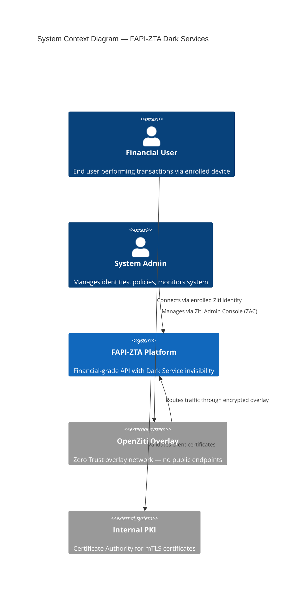
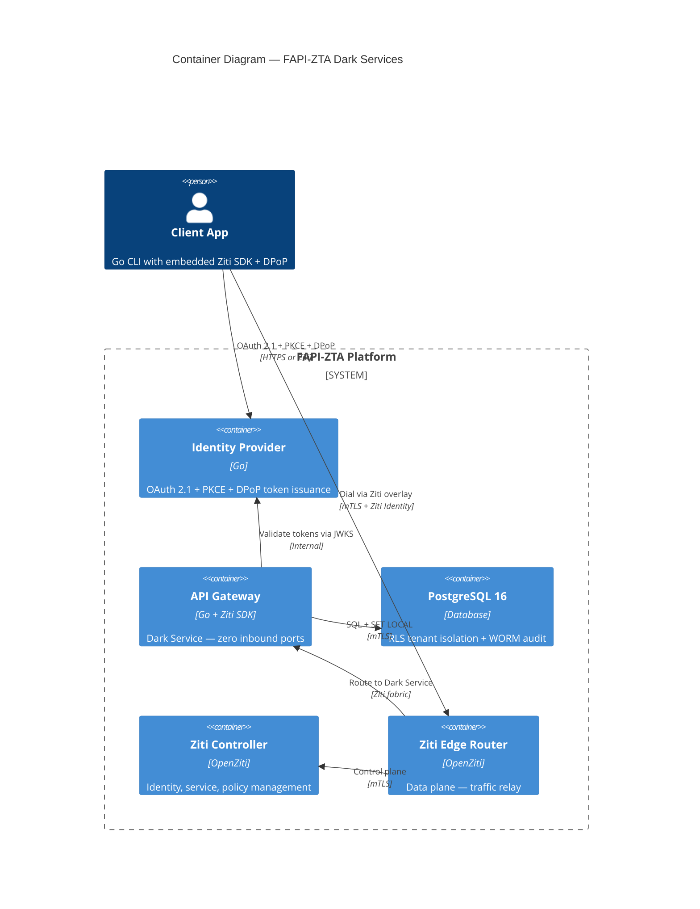
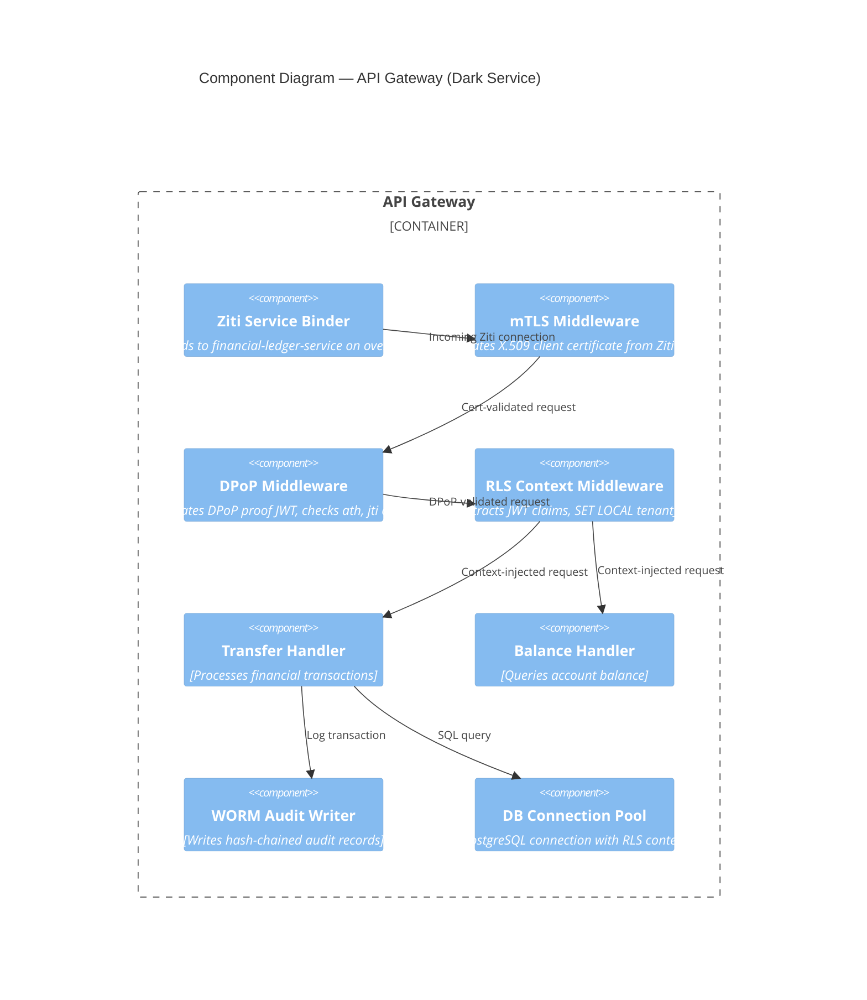
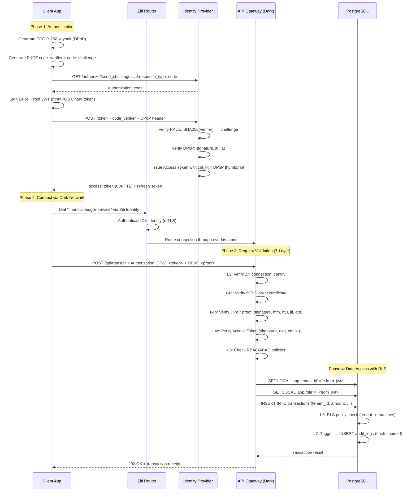

# PART 7 — TARGET ARCHITECTURE

## 7.1 Context Diagram (C4 Level 1)

Tổng quan hệ thống từ góc nhìn bên ngoài: ai tương tác với hệ thống, qua đường nào.



---

## 7.2 Container Diagram (C4 Level 2)

Các container (process/service) bên trong hệ thống và mối quan hệ.



---

## 7.3 Component Diagram (C4 Level 3) — API Gateway



---

## 7.4 Trust Boundary Diagram

```
┌─ TRUST ZONE 0: UNTRUSTED ──────────────────────────────────────┐
│                                                                  │
│   [Internet]  ──X──  NO PATH TO ANY SERVICE                     │
│   [Attacker]  ──X──  Zero ports, zero endpoints                 │
│                                                                  │
├─ TRUST ZONE 1: ZITI OVERLAY (AUTHENTICATED) ───────────────────┤
│                                                                  │
│   ┌──────────┐      ┌──────────────┐      ┌──────────────┐     │
│   │ Enrolled │─mTLS─│ Ziti Edge    │─mTLS─│ Ziti         │     │
│   │ Client   │      │ Router       │      │ Controller   │     │
│   └──────────┘      └──────────────┘      └──────────────┘     │
│                                                                  │
├─ TRUST ZONE 2: APPLICATION (VERIFIED) ─────────────────────────┤
│                                                                  │
│   ┌──────────┐      ┌──────────────┐                            │
│   │ Identity │─────→│ API Gateway  │  ← Dark Service            │
│   │ Provider │      │ (Go+Ziti)    │  ← DPoP + mTLS validated   │
│   └──────────┘      └──────┬───────┘                            │
│                             │                                    │
├─ TRUST ZONE 3: DATA (ENFORCED) ────────────────────────────────┤
│                             │                                    │
│                      ┌──────▼───────┐                            │
│                      │ PostgreSQL   │  ← RLS enforced            │
│                      │ + WORM Audit │  ← Immutable logs          │
│                      └──────────────┘                            │
│                                                                  │
└──────────────────────────────────────────────────────────────────┘
```

---

## 7.5 Data Flow Diagram — Complete Transaction Flow



---

## 7.6 Deployment Architecture

```
┌─────────────────────────────────────────────────────────────┐
│                    Docker Compose Stack                       │
│                                                              │
│  ┌──────────────────┐  ┌──────────────────┐                │
│  │ ziti-controller   │  │ ziti-edge-router  │                │
│  │ :1280 (ctrl)      │  │ :3022 (edge)      │                │
│  │ :6262 (mgmt)      │  │                   │                │
│  └────────┬─────────┘  └────────┬──────────┘                │
│           │                      │                           │
│  ┌────────▼─────────┐           │                           │
│  │ ziti-console      │           │                           │
│  │ (ZAC) :8443       │           │                           │
│  └──────────────────┘           │                           │
│                                  │                           │
│  ┌──────────────────┐  ┌────────▼──────────┐                │
│  │ idp-server        │  │ api-gateway       │                │
│  │ (Go IdP)          │  │ (Go Dark Service) │                │
│  │ Ziti Dark Service │  │ Ziti Dark Service │                │
│  │ NO PUBLIC PORT    │  │ NO PUBLIC PORT    │                │
│  └──────────────────┘  └────────┬──────────┘                │
│                                  │                           │
│                         ┌────────▼──────────┐                │
│                         │ postgresql         │                │
│                         │ :5432 (internal)   │                │
│                         │ RLS + WORM Audit   │                │
│                         └───────────────────┘                │
│                                                              │
│  ┌──────────────────┐  ┌──────────────────┐                 │
│  │ prometheus        │  │ grafana           │                │
│  │ :9090             │  │ :3000             │                │
│  └──────────────────┘  └──────────────────┘                 │
└─────────────────────────────────────────────────────────────┘
```

---

> **Next:** [PART 8 — Identity & Access Architecture](./08_IDENTITY_ACCESS.md)
