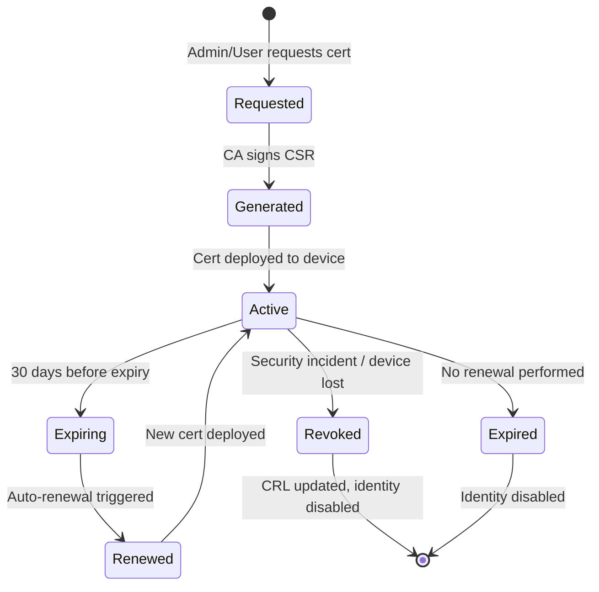
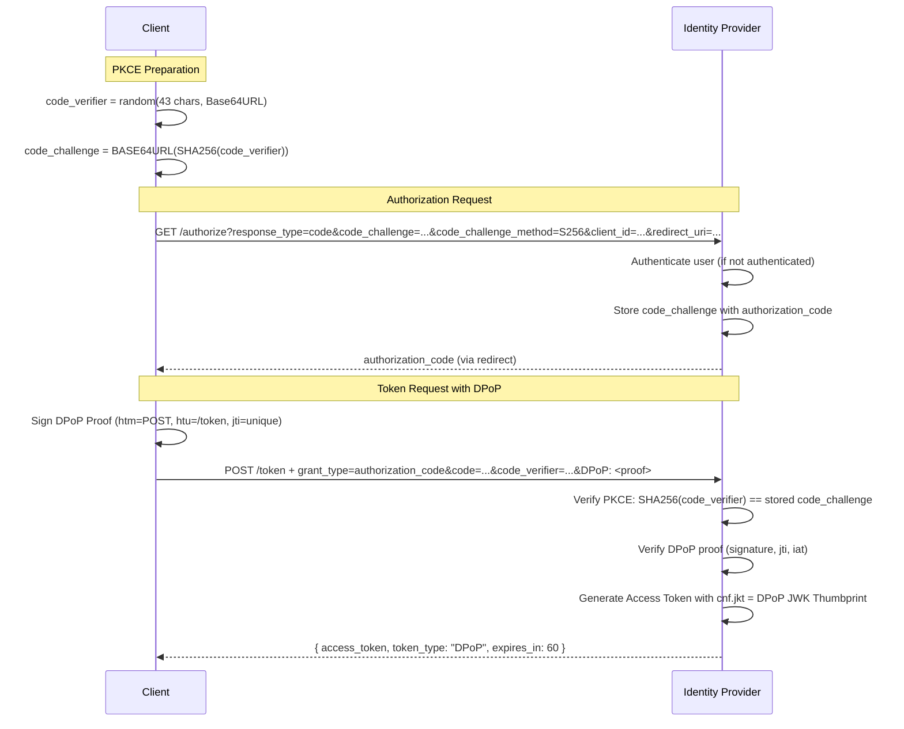
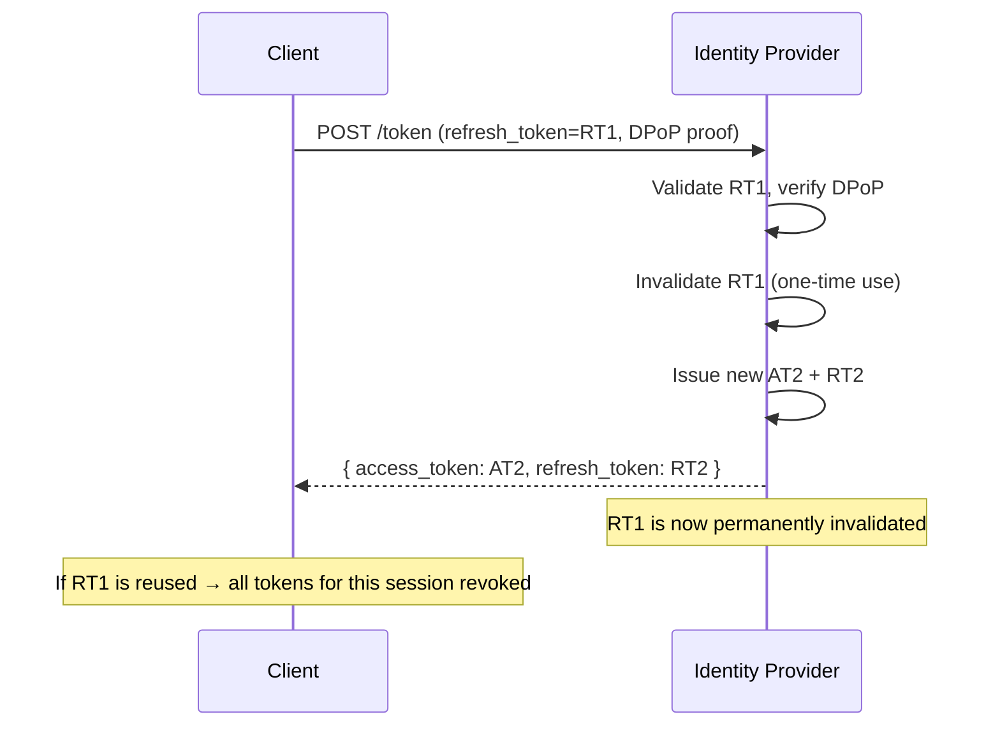

# PART 8 — IDENTITY & ACCESS ARCHITECTURE

## 8.1 PKI Architecture (Public Key Infrastructure)

### Certificate Hierarchy

```
┌─────────────────────────────────┐
│         Root CA (Offline)       │  ← Sinh 1 lần, lưu offline
│   Validity: 10 years            │  ← KHÔNG kết nối mạng
│   Key: ECC P-384                │
│   Self-signed                   │
└────────────┬────────────────────┘
             │ Signs
    ┌────────▼────────────┐
    │  Intermediate CA     │  ← Hoạt động online, ký cert cho services
    │  (Issuing CA)        │
    │  Validity: 3 years   │
    │  Key: ECC P-256      │
    └────────┬─────────────┘
             │ Signs
    ┌────────┼──────────────────────────────┐
    │        │                              │
┌───▼────┐ ┌─▼──────────┐  ┌──────────────▼──┐
│ Server │ │ Client      │  │ Service         │
│ Cert   │ │ Cert        │  │ Cert            │
│        │ │             │  │                 │
│ GW,IdP │ │ End Users   │  │ Service-to-Svc  │
│ 1 year │ │ 90 days     │  │ 1 year          │
└────────┘ └─────────────┘  └─────────────────┘
```

### Certificate Policy

| Certificate Type | Validity | Key Algorithm | Usage | Renewal |
|---|---|---|---|---|
| Root CA | 10 years | ECC P-384 | CA signing only | Manual, offline ceremony |
| Intermediate CA | 3 years | ECC P-256 | Issue end-entity certs | Semi-automated |
| Server (Gateway, IdP) | 1 year | ECC P-256 | TLS server authentication | Automated |
| Client (User device) | 90 days | ECC P-256 | mTLS client authentication | Automated via IdP |
| Service-to-Service | 1 year | ECC P-256 | Internal mTLS | Automated |

---

## 8.2 Certificate Lifecycle Management



### Revocation Strategy
- **CRL (Certificate Revocation List)**: Maintained by CA, checked by Gateway.
- **OCSP Stapling**: Considered for production; CRL sufficient for lab.
- **Ziti Identity Revocation**: Immediate effect — disable identity in Ziti Controller → all connections severed.

---

## 8.3 mTLS Architecture (RFC 8705)

### TLS Handshake Flow (Mutual Authentication)

```
Client                                          Server (Gateway)
  │                                                │
  │──── ClientHello ──────────────────────────────►│
  │                                                │
  │◄─── ServerHello + ServerCert + CertRequest ───│
  │                                                │
  │──── ClientCert + ClientKeyExchange ───────────►│
  │     + CertVerify (signed by client key)        │
  │                                                │
  │◄─── Finished ─────────────────────────────────│
  │──── Finished ─────────────────────────────────►│
  │                                                │
  │◄═══ Encrypted Application Data ═══════════════│
  │     (Both sides authenticated)                 │
```

### Certificate-Bound Access Token
```json
{
  "sub": "user-123",
  "tenant_id": "tenant-abc",
  "role": "transfer_operator",
  "exp": 1719990060,
  "cnf": {
    "x5t#S256": "SHA256_THUMBPRINT_OF_CLIENT_CERT",
    "jkt": "SHA256_THUMBPRINT_OF_DPOP_PUBLIC_KEY"
  }
}
```

Gateway xác thực bằng cách so sánh:
1. `cnf.x5t#S256` với SHA-256 thumbprint của client cert trong TLS handshake.
2. `cnf.jkt` với JWK Thumbprint của DPoP public key trong DPoP proof header.

---

## 8.4 DPoP Architecture (RFC 9449)

### DPoP Proof JWT Structure

**Header:**
```json
{
  "typ": "dpop+jwt",
  "alg": "ES256",
  "jwk": {
    "kty": "EC",
    "crv": "P-256",
    "x": "base64url_x_coordinate",
    "y": "base64url_y_coordinate"
  }
}
```

**Payload:**
```json
{
  "htm": "POST",
  "htu": "https://api.internal/transfer",
  "jti": "unique-random-id-per-request",
  "iat": 1719990000,
  "ath": "SHA256_OF_ACCESS_TOKEN"
}
```

### DPoP Validation Logic (Gateway Side)

```
1. Extract DPoP header from request
2. Parse as JWT
3. Verify typ == "dpop+jwt"
4. Verify alg == "ES256" (only allowed algorithm)
5. Extract jwk from header → compute JWK Thumbprint (RFC 7638)
6. Verify signature using jwk public key
7. Verify htm == request HTTP method
8. Verify htu == request URL
9. Verify iat is within acceptable window (±60 seconds)
10. Verify jti has NOT been seen before (JTI cache check)
11. Compute SHA-256 of Access Token → verify ath matches
12. Verify Access Token cnf.jkt == computed JWK Thumbprint
13. Store jti in cache with TTL matching token lifetime
14. ✅ Request authenticated
```

### JTI Replay Prevention Cache

| Field | Value |
|---|---|
| Storage | In-memory (sync.Map or LRU cache) |
| Key | `jti` string |
| TTL | 120 seconds (2x token lifetime) |
| Eviction | Automatic after TTL |
| Purpose | Prevent DPoP proof replay within validity window |

---

## 8.5 OAuth 2.1 + PKCE Flow



---

## 8.6 Token Architecture

### Access Token
| Property | Value |
|---|---|
| Format | JWT (signed, not encrypted) |
| Algorithm | ES256 (ECC P-256) |
| TTL | **60 seconds** |
| Type | DPoP-bound (`token_type: "DPoP"`) |
| Claims | `sub`, `tenant_id`, `role`, `scope`, `exp`, `iat`, `cnf.jkt` |

### Refresh Token
| Property | Value |
|---|---|
| Format | Opaque string (server-side state) |
| TTL | 24 hours |
| Rotation | **One-time use** — each use issues new refresh token |
| Binding | Sender-constrained (DPoP-bound) |

### Token Rotation Flow



---

## 8.7 Identity Layering (Triple Identity Binding)

Mỗi request hợp lệ phải thỏa mãn **3 lớp định danh** đồng thời:

```
┌──────────────────────────────────────────────────────┐
│                 TRIPLE IDENTITY BINDING                │
├──────────────────────────────────────────────────────┤
│                                                       │
│  Layer 1: Ziti Identity                               │
│  ├── Enrolled identity with Ziti Controller           │
│  ├── Cryptographic identity (X.509 cert)              │
│  └── Must have Dial policy for target service         │
│                                                       │
│  Layer 2: mTLS Certificate Identity                   │
│  ├── X.509 client cert from internal CA               │
│  ├── Certificate-Bound Access Token (cnf.x5t#S256)    │
│  └── Validated during TLS handshake                   │
│                                                       │
│  Layer 3: DPoP Cryptographic Identity                 │
│  ├── ECC P-256 keypair generated on device            │
│  ├── DPoP Proof JWT signed per-request                │
│  └── Access Token bound to DPoP key (cnf.jkt)         │
│                                                       │
│  ═══════════════════════════════════════════          │
│  ALL THREE must match for request to succeed          │
└──────────────────────────────────────────────────────┘
```

---

> **Next:** [PART 9 — Dark Services Architecture](./09_DARK_SERVICES.md)
