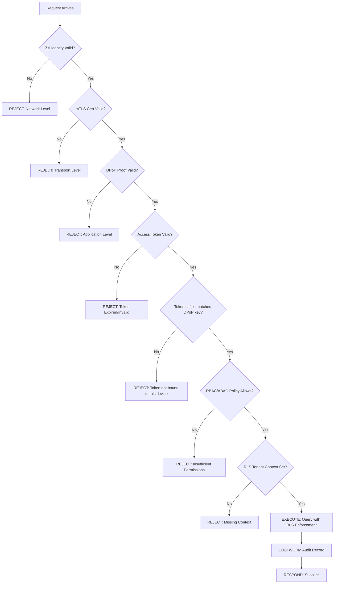
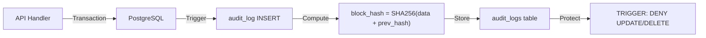

# PART 10 — SECURITY ARCHITECTURE

## 10.1 Zero Trust Policy Framework

### Core Policies

| Policy ID | Policy Name | Enforcement Point | Rule |
|---|---|---|---|
| ZTP-01 | **No Implicit Trust** | All layers | No entity is trusted by default, regardless of network location |
| ZTP-02 | **Verify Every Request** | L4 (Gateway) | Every API request must carry valid DPoP proof + Access Token |
| ZTP-03 | **Least Privilege** | L5 (Policy) + L6 (RLS) | Access granted only to minimum required resources |
| ZTP-04 | **Encrypt Everything** | L3 (Ziti) | All traffic encrypted E2E through overlay, including internal |
| ZTP-05 | **Authenticate Before Connect** | L3 (Ziti) | Ziti Identity must be verified before network connection |
| ZTP-06 | **Continuous Monitoring** | L7 (Audit) + L11 (Observability) | All actions logged, anomalies detected |
| ZTP-07 | **Assume Breach** | All layers | Each layer operates independently — compromise of one does not cascade |

---

## 10.2 Device Trust

### Device Trust Verification Chain

```
Device Trust = Ziti Identity ∩ mTLS Certificate ∩ DPoP Keypair

┌──────────────────────────────────────────────────┐
│              DEVICE TRUST ASSESSMENT              │
├──────────────────────────────────────────────────┤
│                                                   │
│  Check 1: Ziti Identity Enrolled?                 │
│  ├── Identity JSON present on device              │
│  ├── Identity not revoked in Controller           │
│  └── FAIL → Cannot connect to overlay             │
│                                                   │
│  Check 2: mTLS Certificate Valid?                 │
│  ├── Signed by trusted Internal CA                │
│  ├── Not expired (within validity period)         │
│  ├── Not revoked (CRL check)                      │
│  └── FAIL → TLS handshake rejected               │
│                                                   │
│  Check 3: DPoP Keypair Available?                 │
│  ├── ECC P-256 keypair in secure storage          │
│  ├── Can sign DPoP proofs                         │
│  └── FAIL → Token requests rejected              │
│                                                   │
│  ALL THREE ✅ = Device Trusted                    │
│  ANY ONE ❌ = Device Untrusted → Access Denied    │
└──────────────────────────────────────────────────┘
```

---

## 10.3 User Trust

| Trust Factor | Verification Method | Frequency |
|---|---|---|
| Identity | OAuth 2.1 authentication via IdP | Per-session |
| Authorization | RBAC role from JWT claims | Per-request |
| Possession | DPoP proof (proves private key ownership) | Per-request |
| Device binding | mTLS cert + Ziti Identity | Per-connection |
| Freshness | Token TTL 60s + DPoP `iat` check | Per-request |

---

## 10.4 Service Trust

| Trust Factor | Mechanism |
|---|---|
| Service Identity | Ziti Identity with Bind permission |
| Service Authentication | mTLS between Gateway and Database |
| Service Authorization | Ziti Service Policies (Bind/Dial) |
| Data Isolation | PostgreSQL RLS per tenant |

---

## 10.5 Continuous Verification Model



---

## 10.6 Security Policy Matrix

| Resource | Role: viewer | Role: operator | Role: admin | Unauthenticated |
|---|---|---|---|---|
| `GET /api/balance` | ✅ Own data | ✅ Own data | ✅ All data | ❌ |
| `POST /api/transfer` | ❌ | ✅ Own tenant | ✅ All tenants | ❌ |
| `GET /api/audit` | ❌ | ✅ Own tenant | ✅ All tenants | ❌ |
| `POST /api/admin/users` | ❌ | ❌ | ✅ | ❌ |
| `DELETE /api/audit/*` | ❌ | ❌ | ❌ (WORM) | ❌ |

**Note:** Even admin cannot DELETE audit records — enforced by database trigger (WORM).

---

# PART 11 — OBSERVABILITY ARCHITECTURE

## 11.1 Three Pillars + Audit

```
┌─────────────────────────────────────────────────────────────┐
│                  OBSERVABILITY ARCHITECTURE                   │
├─────────────────────────────────────────────────────────────┤
│                                                              │
│  ┌──────────┐  ┌──────────┐  ┌──────────┐  ┌──────────┐   │
│  │ METRICS  │  │ LOGS     │  │ TRACES   │  │ AUDIT    │   │
│  │          │  │          │  │          │  │          │   │
│  │ Promethe │  │ Loki     │  │ (Future) │  │ WORM     │   │
│  │ us       │  │          │  │ OpenTele │  │ Vault    │   │
│  │          │  │          │  │ metry    │  │          │   │
│  └────┬─────┘  └────┬─────┘  └────┬─────┘  └────┬─────┘   │
│       │              │              │              │         │
│       └──────────────┼──────────────┘              │         │
│                      │                             │         │
│              ┌───────▼────────┐           ┌────────▼──────┐ │
│              │    Grafana     │           │  PostgreSQL   │ │
│              │  (Dashboard)   │           │  (Immutable)  │ │
│              └────────────────┘           └───────────────┘ │
└─────────────────────────────────────────────────────────────┘
```

## 11.2 Metrics (Prometheus)

### Key Metrics to Collect

| Metric Name | Type | Description |
|---|---|---|
| `fapi_requests_total` | Counter | Total API requests by endpoint, method, status |
| `fapi_dpop_validations_total` | Counter | DPoP proof validations (success/failure) |
| `fapi_mtls_validations_total` | Counter | mTLS cert validations (success/failure) |
| `fapi_token_rejections_total` | Counter | Token rejections by reason |
| `fapi_request_duration_seconds` | Histogram | Request latency distribution |
| `fapi_active_connections` | Gauge | Current active Ziti connections |
| `fapi_audit_chain_length` | Gauge | Number of records in audit chain |
| `fapi_jti_cache_size` | Gauge | Current JTI replay cache entries |

## 11.3 Logs (Loki)

### Structured Log Format

```json
{
  "timestamp": "2026-07-03T15:00:00Z",
  "level": "INFO",
  "service": "api-gateway",
  "event": "request_authenticated",
  "request_id": "req-abc-123",
  "tenant_id": "tenant-xyz",
  "user_id": "user-456",
  "method": "POST",
  "path": "/api/transfer",
  "dpop_jti": "dpop-jti-789",
  "ziti_identity": "client-alice",
  "latency_ms": 45
}
```

## 11.4 Audit (WORM Vault)

### Audit Record Structure

| Field | Type | Description |
|---|---|---|
| `id` | BIGSERIAL | Sequential block number |
| `timestamp` | TIMESTAMPTZ | Event time |
| `actor_id` | UUID | Who performed the action |
| `tenant_id` | UUID | Which tenant context |
| `action` | TEXT | What was done (CREATE, READ, UPDATE, DELETE) |
| `resource` | TEXT | What resource was affected |
| `details` | JSONB | Additional context |
| `prev_hash` | TEXT | SHA-256 hash of previous record |
| `block_hash` | TEXT | SHA-256(id + timestamp + actor + action + resource + details + prev_hash) |

### Data Flow



---

# PART 12 — COMPLIANCE MAPPING

## 12.1 NIST SP 800-207 Zero Trust Architecture

| NIST ZTA Tenet | Implementation | Evidence |
|---|---|---|
| Tenet 1: All resources are protected | Dark Service + mTLS + RLS | Zero public endpoints, cert-required access |
| Tenet 2: Encrypt all communication | OpenZiti E2E + mTLS | AES-256-GCM through overlay fabric |
| Tenet 3: Per-session access | DPoP per-request + 60s TTL | Unique jti per request, token expires in 60s |
| Tenet 4: Dynamic policy | RBAC + ABAC from JWT claims | Role-based + attribute-based decisions |
| Tenet 5: Monitor all assets | Prometheus + Loki + Audit | Continuous metrics, structured logs |
| Tenet 6: Strict auth before access | mTLS + DPoP + Ziti Identity | Triple authentication before any data access |
| Tenet 7: Continuous improvement | Audit data → policy refinement | WORM vault feeds security reviews |

## 12.2 OWASP API Security Top 10 (2023)

| # | OWASP Risk | Mitigation | Layer |
|---|---|---|---|
| API1 | Broken Object Level Auth | RLS enforces tenant isolation at DB level | L6 |
| API2 | Broken Authentication | DPoP + mTLS + PKCE (FAPI 2.0 compliant) | L1, L2, L4 |
| API3 | Broken Object Property Level Auth | RBAC per-field authorization | L5 |
| API4 | Unrestricted Resource Consumption | Dark Service eliminates public DDoS surface | L3 |
| API5 | Broken Function Level Auth | RBAC role-based endpoint access | L5 |
| API6 | Unrestricted Access to Sensitive Business Flows | Rate limiting + WORM audit trail | L4, L7 |
| API7 | Server Side Request Forgery | No public endpoints to exploit | L3 |
| API8 | Security Misconfiguration | Infrastructure as Code (Docker Compose) | All |
| API9 | Improper Inventory Management | Single documented service catalog in Ziti | L3 |
| API10 | Unsafe Consumption of APIs | mTLS for all service-to-service calls | L3, L4 |

## 12.3 PCI DSS Alignment

| PCI DSS Req | Description | Implementation |
|---|---|---|
| Req 1 | Network security controls | OpenZiti overlay, zero public ports |
| Req 2 | Secure configurations | Docker Compose IaC, hardened defaults |
| Req 3 | Protect stored data | PostgreSQL encryption, RLS isolation |
| Req 4 | Encrypt transmission | mTLS + Ziti E2E encryption |
| Req 7 | Restrict access | RBAC + ABAC + Ziti policies |
| Req 8 | Identify users | mTLS cert + DPoP identity + Ziti enrollment |
| Req 10 | Log and monitor | WORM audit + Prometheus + Loki |
| Req 11 | Test security | Penetration test plan (Part 15) |

## 12.4 FAPI 2.0 Compliance

| FAPI 2.0 Requirement | Status | Implementation |
|---|---|---|
| Sender-constrained access tokens | ✅ | DPoP (RFC 9449) with cnf.jkt claim |
| PKCE with S256 | ✅ | Mandatory in all auth code flows |
| mTLS client authentication | ✅ | X.509 cert validation at Gateway |
| Short-lived access tokens | ✅ | 60-second TTL |
| Confidential client authentication | ✅ | mTLS + DPoP dual binding |
| Formal attacker model consideration | ✅ | STRIDE + Kill Chain analysis (Part 5) |

---

> **Next:** [PART 13 — Implementation Roadmap](./13_IMPLEMENTATION_ROADMAP.md)
