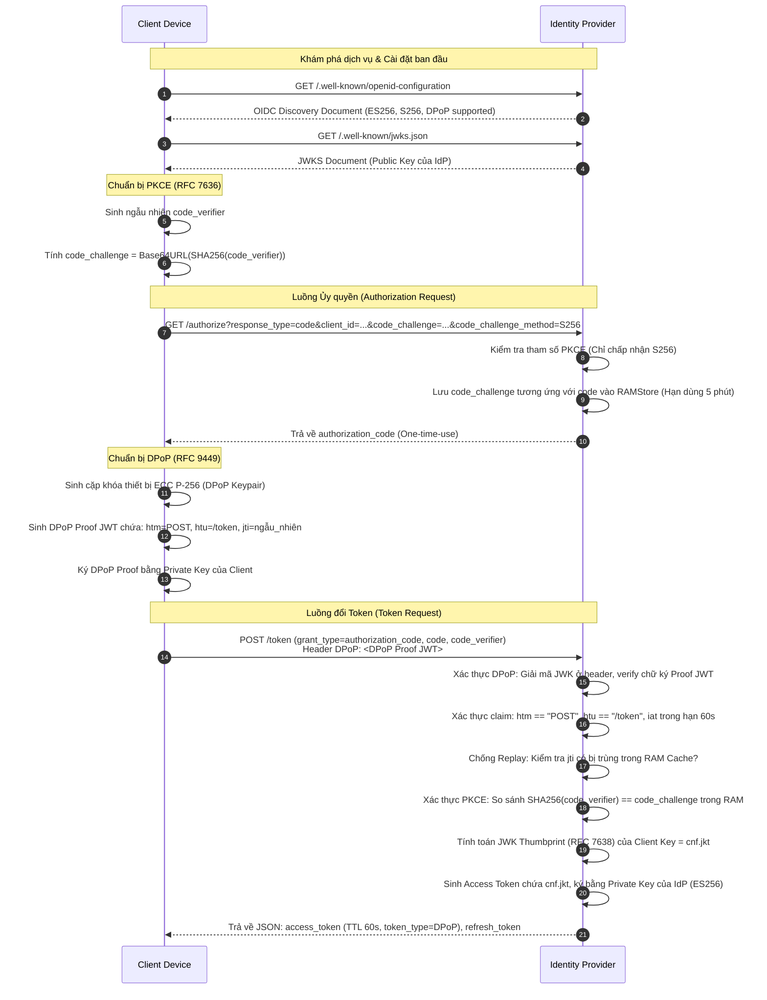
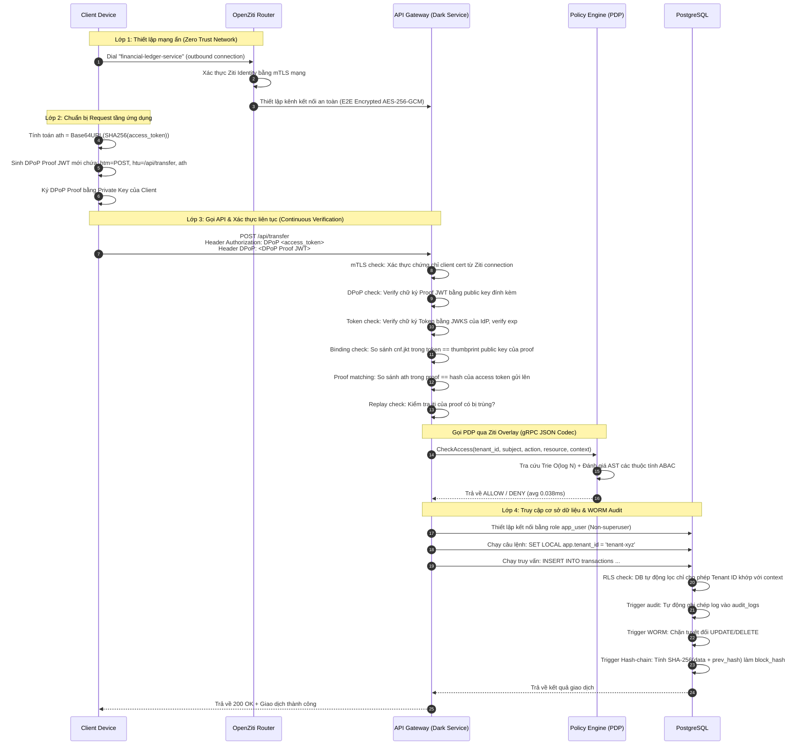
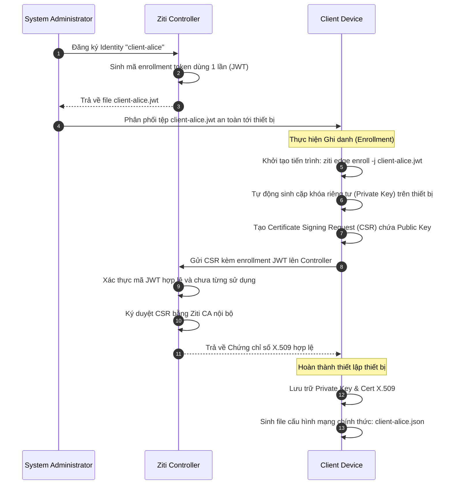

# PART 17 — SEQUENCE DIAGRAMS

Tài liệu này cung cấp các sơ đồ tuần tự (Sequence Diagrams) trực quan mô tả chi tiết các luồng nghiệp vụ bảo mật cốt lõi của hệ thống **secure-fapi-zta-darkservices**.

---

## 17.1 Luồng đăng nhập và cấp phát Token ràng buộc (Login & Token Exchange Flow)

Sơ đồ này mô tả chi tiết các bước từ khi Client khám phá cấu hình IdP, thực hiện luồng PKCE và nhận về DPoP-bound Access Token (đáp ứng tiêu chuẩn FAPI 2.0).

---

## 17.2 Luồng truy cập dịch vụ tàng hình (Service Access Flow)

Sơ đồ này mô tả chi tiết cách thức Client vượt qua lớp mạng ảo tàng hình OpenZiti, xác thực mTLS và gửi request kèm DPoP-bound Access Token để Gateway thực thi truy vấn Row-Level Security (RLS) an toàn.

---

## 17.3 Luồng ghi danh thiết bị Client (Client Identity Enrollment Flow)

Sơ đồ này mô tả cách Ziti Controller cấp phát chứng chỉ số X.509 an toàn cho một danh tính mạng mới thông qua quy trình ghi danh một lần.

